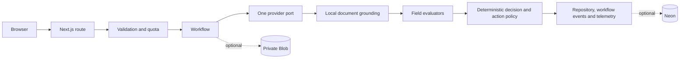

# Document Intelligence Assurance Hub

Interpret ten synthetic supplier invoice and warehouse goods receipt variants then inspect field evidence, a deterministic assurance decision and one constrained action proposal. The Workbench turns each verified outcome into simulated preparation options with a durable activity timeline. Operations exposes public-safe traces, workflow readiness, the provider-neutral Reference quality suite and an illustrative resource calculator.

- [Open the Workbench](https://document-intelligence-assurance-hub.vercel.app/workbench)
- [Open the Operations Console](https://document-intelligence-assurance-hub.vercel.app/operations)

The public routes are portfolio review surfaces. Configuration alone is not acceptance evidence. All four visible live model routes remain a post-key rollout gate. Built-in OpenAI processing, built-in Anthropic processing, custom OpenAI processing and custom Anthropic processing each remain pending until that exact path passes its own connected production smoke test. No API key was used and no provider call was made for this documentation update.

This is a public-safe portfolio application. Use synthetic fixtures unless you choose the custom-upload path and understand that the run is voluntarily public until expiry or deletion. Never upload personal data, confidential business data, credentials or regulated records.

## Processing routes

`GET /api/models` returns the server-owned catalogue, provider defaults and availability booleans. It never returns a credential. OpenAI and Anthropic keys remain server-side.

`POST /api/runs` derives execution mode from the validated model provider and current server-owned provider availability. The multipart execution mode and matching preflight header are request-consistency metadata only. They cannot force fallback, force live processing or switch providers.

For a built-in sample the selected model controls the route. When its provider is available `Process document` sends the sample through that selected model adapter. When the provider is unavailable the same button uses the checked-in deterministic result and the interface states `Sample results - no AI processing`. A selected or enabled model is not proof that a provider request occurred.

Custom uploads have no recorded fallback. An unavailable selected provider disables `Process document` and shows `Processing unavailable for this model`. The file, requested fields and consent remain local to the form until the reviewer can choose an available route.

Only `Process document` can create a model-budget reservation. Browsing samples, opening previews, comparing runs and preparing simulated workflow actions cannot reserve model spend. Persisted `providerDispatched=true` is the only execution fact used to report a provider call. Configured provider and model values remain separate from actual attribution.

## Model catalogue

The server owns the four-model catalogue and dated pricing metadata. Requests fail closed when the chosen model does not belong to the selected provider.

| Provider  | Model ID           | Display name     | Catalogue role       |
| --------- | ------------------ | ---------------- | -------------------- |
| OpenAI    | `gpt-5.6-luna`     | GPT-5.6 Luna     | Recommended for cost |
| OpenAI    | `gpt-5.6-terra`    | GPT-5.6 Terra    | Higher accuracy      |
| Anthropic | `claude-haiku-4-5` | Claude Haiku 4.5 | Recommended for cost |
| Anthropic | `claude-sonnet-5`  | Claude Sonnet 5  | Higher accuracy      |

## Architecture



See [docs/architecture.md](docs/architecture.md) for adapter boundaries and trust assumptions.

## Responsible AI safeguards

- Model output must pass a structured schema before evaluation.
- Provider-routed evidence must map to a contiguous span on its claimed page before server-owned normalization can pass it.
- Typed fixture evidence is native PDF text. Handwritten reviewer and receiver comments are embedded as raster images so the selected model must interpret the visible handwriting rather than selectable comment text.
- Text-native PDFs are parsed locally. PNG, JPEG and scanned PDF pages use bounded local OCR with bundled English language data. Document bytes are not sent to another grounding service.
- Unclear critical handwriting must return null and resolve as Not found. The model is instructed not to guess or reconstruct obscured characters from business context.
- Clear requires every requested field to pass deterministic checks and any supplied reference comparison.
- Provider failures use stable public error codes. Hidden provider details are not returned.
- Provider-routed processing has per-browser limits, global limits and a parsed daily model budget.
- Connected mode enforces deployment-wide minute ceilings in Neon for submissions, documents, metrics, run lists and active traces. Rotating the anonymous cookie does not bypass each resource's global ceiling.
- Duplicate submissions use a durable idempotency claim when Neon is connected.
- Documents are private in Blob and are served only through active same-origin routes.
- Cancellation propagates through the response stream, workflow and provider request.
- Action policy runs on the server after evaluation. A proposal cannot approve or execute a business action.
- Workflow actions use the browser-held run capability plus server-owned status, outcome and recipient-role policy. Recipient-required actions accept one synthetic business-role label and never an address.
- `Prepare email copy` returns a bounded preview labelled `Prepared only - not sent`. Its subject and body are not persisted. The interface can copy the text but cannot send it.
- `/api/runs/:id/stage-action` remains an idempotent compatibility mapping to the simulated `approve_and_stage` event. Real email and every ERP, ticketing, payment, inventory or access-control connector remain out of scope.

## Evaluation status

The Reference quality suite contains 10 provider-neutral observations: 5 supplier invoices and 5 warehouse goods receipts. Its classifications are 2 Correct, 4 Needs attention and 4 Incorrect. Expected outcomes are 2 Clear, 6 Needs review and 2 Incomplete. It detects 2 of 2 unreadable critical fixtures and the false-clear count is zero.

A separate 10 by 2 recorded-adapter matrix contains 20 schema and configuration cases. Each fixture is checked under the OpenAI configuration and the Anthropic configuration without a provider call. These cases are not provider observations and are not a model-accuracy measurement. See [docs/evaluation-report.md](docs/evaluation-report.md).

## Operations and Costs metric populations

Operations combines six server-side data sources behind a 15-second cache. The summary cards use a repository-wide anonymous run aggregate. Lifecycle uses a repository-wide active-detail aggregate plus the repository-wide cleanup backlog. Workflow status, workflow activity, processing performance and the run explorer use the newest 100 public run summaries with active detail where available.

Costs keeps provider execution evidence separate from budget accounting. Confirmed provider usage, model and document-family breakdowns plus completed-run cost estimates use only confirmed dispatched completed runs with trustworthy nonzero token usage. When that population is empty the dashboard shows `No confirmed model runs` and US$0.00. A failed dispatched request can contribute conservative settled spend but it is excluded from completed-run estimates and their average.

The quota ledger supplies settled spend for today and month to date. Daily budget use is settled spend plus active reservations and remaining budget is clamped at zero. These quota values must not be combined with completed-run estimates as if they were the same population.

The Reference quality suite is a separate fixed set of exactly 10 provider-neutral observations. The resource calculator is an illustrative scenario rather than measured savings. It converts only the confirmed average model cost into its SGD assumption at `US$1 = S$1.35` and trusts the server-supplied pricing date.

## Local setup

Requirements: Node.js 20 or later and npm 11.3.0.

```bash
npm ci
copy .env.example .env.local
npm run dev
```

Keep `AI_LIVE_ENABLED=false` when provider credentials are not intentionally under test. Local keyless operation uses process-memory adapters when database and Blob variables are absent. Built-in samples then use deterministic results while custom processing is unavailable. Restarting the process clears local runs and workflow events. No external connector exists for simulated workflow preparation.

## Verification commands

```bash
npm run format:check
npm run lint
npm run typecheck
npm run test:unit
npm run test:component
npm run test:contract
npm run test:a11y
npm run test:e2e
npm run verify:premium
npm run build:production
npm run verify:public
npm run audit:dependencies
```

The earlier three-fixture walkthrough and its video link are retired because they do not represent the current ten-reference library. Do not submit or cite that recording. The [current keyless walkthrough](artifacts/walkthrough.webm) shows both document families, current Workbench and Operations labels plus explicit `No AI processing` attribution. It made no provider call. Rerun the dependency audit for every rollout.

## Connected persistence

Production requires `DATABASE_URL` and `BLOB_READ_WRITE_TOKEN` together. Create a Neon database then apply every migration in numeric order before starting the application. Create a private Vercel Blob store and keep its token server-side. Do not expose either value through a `NEXT_PUBLIC_` variable.

```bash
psql "$DATABASE_URL" -v ON_ERROR_STOP=1 -f migrations/0001_assurance_hub.sql
psql "$DATABASE_URL" -v ON_ERROR_STOP=1 -f migrations/0002_provider_lifecycle.sql
psql "$DATABASE_URL" -v ON_ERROR_STOP=1 -f migrations/0003_public_resource_controls.sql
psql "$DATABASE_URL" -v ON_ERROR_STOP=1 -f migrations/0004_conservative_provider_budget.sql
psql "$DATABASE_URL" -v ON_ERROR_STOP=1 -f migrations/0005_provider_dispatch_budget.sql
psql "$DATABASE_URL" -v ON_ERROR_STOP=1 -f migrations/0006_bounded_provider_settlement.sql
psql "$DATABASE_URL" -v ON_ERROR_STOP=1 -f migrations/0007_provider_dispatch_attribution.sql
psql "$DATABASE_URL" -v ON_ERROR_STOP=1 -f migrations/0008_document_workflow.sql
psql "$DATABASE_URL" -v ON_ERROR_STOP=1 -f migrations/0009_completed_run_aggregates.sql
psql "$DATABASE_URL" -c "SELECT version, applied_at FROM schema_migrations ORDER BY version;"
```

PowerShell users can replace `$DATABASE_URL` with `$env:DATABASE_URL`. The migration is versioned and idempotent. Routine application requests do not create or alter schema.

## Environment variables

| Variable                        | Required             | Purpose                                                                                                                     |
| ------------------------------- | -------------------- | --------------------------------------------------------------------------------------------------------------------------- |
| `AI_LIVE_ENABLED`               | Yes                  | Global model kill switch. Keep `false` until live acceptance passes.                                                        |
| `OPENAI_API_KEY`                | Live OpenAI only     | Server-side provider credential.                                                                                            |
| `ANTHROPIC_API_KEY`             | Live Anthropic only  | Server-side provider credential.                                                                                            |
| `GLOBAL_DAILY_MODEL_BUDGET_USD` | Yes                  | Positive finite daily budget with a US$5 default. Invalid values stop startup.                                              |
| `DATABASE_URL`                  | Production           | Server-side Neon connection string.                                                                                         |
| `BLOB_READ_WRITE_TOKEN`         | Production           | Server-side private Blob credential.                                                                                        |
| `CRON_SECRET`                   | Connected production | Random bearer secret of at least 32 characters with no whitespace. Weak or missing values stop request-serving startup.     |
| `PUBLIC_SITE_URL`               | Rollout              | Stable public origin used by rollout tooling.                                                                               |
| `ALLOW_IN_MEMORY_PERSISTENCE`   | Local exception only | Allows recorded synthetic production smoke tests without durable adapters. Custom uploads and live mode remain unavailable. |

Never commit environment files or paste secret values into logs, issues or recordings.

## Retention and deletion

Active access ends after 23 hours and 55 minutes. Delete now uses a one-time raw token returned only with the terminal stream. The repository tombstones traces, results, workflow events and the document locator before it attempts physical Blob deletion. If Blob cleanup fails then access remains denied and the hourly purge retries the durable cleanup job.

The application does not provide user accounts or private per-user run visibility. Every workflow mutation is protected by the browser-held run capability but that capability is not enterprise authentication. See [docs/privacy-and-retention.md](docs/privacy-and-retention.md).

## API routes

| Method   | Route                            | Purpose                                                                                                                                                  |
| -------- | -------------------------------- | -------------------------------------------------------------------------------------------------------------------------------------------------------- |
| `POST`   | `/api/runs`                      | Derive server-owned admission, validate quota then stream one assurance run. Requires `Idempotency-Key`, `X-Run-Source-Type` and `X-Run-Execution-Mode`. |
| `GET`    | `/api/models`                    | Return the server-owned catalogue, defaults and provider-availability booleans without credentials.                                                      |
| `GET`    | `/api/runs`                      | List bounded active public run summaries.                                                                                                                |
| `GET`    | `/api/runs/:id`                  | Read one public-safe active run.                                                                                                                         |
| `POST`   | `/api/runs/:id/workflow-actions` | Persist one capability-protected simulated workflow event under outcome and recipient-role policy.                                                       |
| `POST`   | `/api/runs/:id/stage-action`     | Compatibility mapping that persists the same idempotent `approve_and_stage` event.                                                                       |
| `DELETE` | `/api/runs/:id`                  | Tombstone details with the one-time deletion token.                                                                                                      |
| `GET`    | `/api/runs/:id/document`         | Serve one active document through a no-store same-origin response.                                                                                       |
| `GET`    | `/api/metrics`                   | Return public-safe operational, action-readiness and deterministic benchmark aggregates.                                                                 |
| `GET`    | `/api/cron/purge-expired`        | Tombstone expired details and retry physical cleanup.                                                                                                    |

## Deployment readiness

The repository contains an hourly Vercel Cron schedule at `0 * * * *`. A Vercel plan that cannot run hourly Cron is a rollout blocker. Routes use the Node.js runtime for streaming, crypto, Neon and Blob compatibility.

Follow [docs/deployment-checklist.md](docs/deployment-checklist.md). The stable links are review targets rather than acceptance evidence for this revision. Configuration, catalogue visibility and an enabled provider boolean do not accept a processing route.

## Limitations and live-acceptance gate

This application lacks authentication, private tenant boundaries, malware scanning, data-loss prevention and a formally approved enterprise retention policy. Public custom uploads are voluntary and unsuitable for sensitive information. Its workflow capability persists simulated internal state only. Prepared email copy is response-only and no route can send email or contact an external business system.

All four visible live model routes remain a post-key rollout gate:

| Model            | Status  | Production evidence required                                                  |
| ---------------- | ------- | ----------------------------------------------------------------------------- |
| GPT-5.6 Luna     | Pending | One connected run with confirmed dispatch, grounded evidence and settled cost |
| GPT-5.6 Terra    | Pending | One connected run with confirmed dispatch, grounded evidence and settled cost |
| Claude Haiku 4.5 | Pending | One connected run with confirmed dispatch, grounded evidence and settled cost |
| Claude Sonnet 5  | Pending | One connected run with confirmed dispatch, grounded evidence and settled cost |

Source-path acceptance also remains pending:

| Route                             | Status  | Production evidence required                                                                                              |
| --------------------------------- | ------- | ------------------------------------------------------------------------------------------------------------------------- |
| Built-in sample through OpenAI    | Pending | One connected run using the selected OpenAI model with confirmed dispatch, grounded evidence and deterministic outcome    |
| Built-in sample through Anthropic | Pending | One connected run using the selected Anthropic model with confirmed dispatch, grounded evidence and deterministic outcome |
| Custom upload through OpenAI      | Pending | One consented public upload using the selected OpenAI model with confirmed dispatch and no fallback                       |
| Custom upload through Anthropic   | Pending | One consented public upload using the selected Anthropic model with confirmed dispatch and no fallback                    |

After keys are introduced the rollout gate must exercise built-in and custom source paths for both providers. Acceptance requires one deliberate provider failure and one production retention simulation. Each check must preserve safe errors, durable quotas and logical denial before cleanup. Passing one model or source path does not accept any other model or path.

The production acceptance must also exercise one text-native PDF and one PNG or scanned PDF on the target Linux runtime. A local Windows build proves the code path and bundled manifests but it does not prove the target native canvas binary until Vercel builds the deployment.
