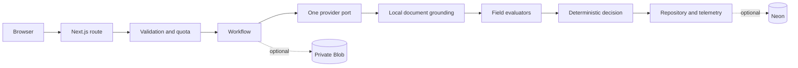

# Document Intelligence Assurance Hub

Review a document against purchase-order reference data then inspect field evidence and a deterministic assurance decision. The Workbench streams each stage. Operations exposes public-safe traces, recorded benchmark quality and an illustrative resource calculator.

- [Open the Workbench](https://document-intelligence-assurance-hub.vercel.app/workbench)
- [Open the Operations Console](https://document-intelligence-assurance-hub.vercel.app/operations)

The stable production deployment currently runs in recorded keyless mode with Neon telemetry and private Blob document storage. `AI_LIVE_ENABLED` remains false and model-provider keys are absent.

This is a public-safe prototype. Use synthetic fixtures unless you choose the custom-upload path and understand that the run is voluntarily public until expiry or deletion. Never upload personal data, confidential business data, credentials or regulated records.

## Modes

Recorded mode is the default and works without model credentials. It replays deterministic synthetic contracts for both provider selections. No model request occurs.

Live mode is disabled unless `AI_LIVE_ENABLED=true` and the selected server-side key exists. When enabled the runtime integrates directly with the OpenAI API or Anthropic API through one provider port. No live provider run is claimed in this repository. Live acceptance remains pending.

## Architecture



See [docs/architecture.md](docs/architecture.md) for adapter boundaries and trust assumptions.

## Responsible AI safeguards

- Model output must pass a structured schema before evaluation.
- Live evidence must map to a contiguous span on its claimed page before server-owned normalization can pass it.
- Text-native PDFs are parsed locally. PNG, JPEG and scanned PDF pages use bounded local OCR with bundled English language data. Document bytes are not sent to another grounding service.
- Clear requires every requested field to pass deterministic checks and any supplied reference comparison.
- Provider failures use stable public error codes. Hidden provider details are not returned.
- Live mode has per-browser limits, global limits and a parsed daily model budget.
- Connected mode enforces deployment-wide minute ceilings in Neon for submissions, documents, metrics, run lists and active traces. Rotating the anonymous cookie does not bypass each resource's global ceiling.
- Duplicate submissions use a durable idempotency claim when Neon is connected.
- Documents are private in Blob and are served only through active same-origin routes.
- Cancellation propagates through the response stream, workflow and provider request.

## Evaluation status

Six recorded benchmark replays cover three fixtures across two provider selections. Clean resolves Clear. Invoice-total mismatch resolves Needs review. Missing purchase order resolves Incomplete. The recorded false-clear count is zero.

These are deterministic contract checks. They are not live provider accuracy measurements. See [docs/evaluation-report.md](docs/evaluation-report.md).

## Local setup

Requirements: Node.js 20 or later and npm 11.3.0.

```bash
npm ci
copy .env.example .env.local
npm run dev
```

Keep `AI_LIVE_ENABLED=false` for the keyless path. Local keyless mode uses process-memory adapters when database and Blob variables are absent. Restarting the process clears those local runs.

## Verification commands

```bash
npm run format:check
npm run lint
npm run typecheck
npm run test:unit
npm run test:component
npm run test:contract
npm run test:a11y
npm run test:e2e
npm run verify:premium
npm run build:production
npm run verify:public
npm run audit:dependencies
```

`npm run record:walkthrough -- --base-url http://127.0.0.1:3100 --output artifacts/walkthrough.webm` records the real browser flow. The 2026-08-28 local dependency audit reported zero vulnerabilities. Rerun it for every rollout.

## Connected persistence

Production requires `DATABASE_URL` and `BLOB_READ_WRITE_TOKEN` together. Create a Neon database then apply every migration in numeric order before starting the application. Create a private Vercel Blob store and keep its token server-side. Do not expose either value through a `NEXT_PUBLIC_` variable.

```bash
psql "$DATABASE_URL" -v ON_ERROR_STOP=1 -f migrations/0001_assurance_hub.sql
psql "$DATABASE_URL" -v ON_ERROR_STOP=1 -f migrations/0002_provider_lifecycle.sql
psql "$DATABASE_URL" -v ON_ERROR_STOP=1 -f migrations/0003_public_resource_controls.sql
psql "$DATABASE_URL" -v ON_ERROR_STOP=1 -f migrations/0004_conservative_provider_budget.sql
psql "$DATABASE_URL" -v ON_ERROR_STOP=1 -f migrations/0005_provider_dispatch_budget.sql
psql "$DATABASE_URL" -v ON_ERROR_STOP=1 -f migrations/0006_bounded_provider_settlement.sql
psql "$DATABASE_URL" -c "SELECT version, applied_at FROM schema_migrations ORDER BY version;"
```

PowerShell users can replace `$DATABASE_URL` with `$env:DATABASE_URL`. The migration is versioned and idempotent. Routine application requests do not create or alter schema.

## Environment variables

| Variable                        | Required             | Purpose                                                                                                                     |
| ------------------------------- | -------------------- | --------------------------------------------------------------------------------------------------------------------------- |
| `AI_LIVE_ENABLED`               | Yes                  | Global model kill switch. Keep `false` until live acceptance passes.                                                        |
| `OPENAI_MODEL`                  | No                   | OpenAI model ID. The safe default is `gpt-5-mini`.                                                                          |
| `ANTHROPIC_MODEL`               | No                   | Anthropic model ID. The safe default is `claude-haiku-4-5`.                                                                 |
| `OPENAI_API_KEY`                | Live OpenAI only     | Server-side provider credential.                                                                                            |
| `ANTHROPIC_API_KEY`             | Live Anthropic only  | Server-side provider credential.                                                                                            |
| `GLOBAL_DAILY_MODEL_BUDGET_USD` | Yes                  | Positive finite daily budget. Invalid values stop startup.                                                                  |
| `DATABASE_URL`                  | Production           | Server-side Neon connection string.                                                                                         |
| `BLOB_READ_WRITE_TOKEN`         | Production           | Server-side private Blob credential.                                                                                        |
| `CRON_SECRET`                   | Connected production | Random bearer secret of at least 32 characters with no whitespace. Weak or missing values stop request-serving startup.     |
| `PUBLIC_SITE_URL`               | Rollout              | Stable public origin used by rollout tooling.                                                                               |
| `ALLOW_IN_MEMORY_PERSISTENCE`   | Local exception only | Allows recorded synthetic production smoke tests without durable adapters. Custom uploads and live mode remain unavailable. |

Never commit environment files or paste secret values into logs, issues or recordings.

## Retention and deletion

Active access ends after 23 hours and 55 minutes. Delete now uses a one-time raw token returned only with the terminal stream. The repository tombstones details before it attempts physical Blob deletion. If Blob cleanup fails then access remains denied and the hourly purge retries the durable cleanup job.

The prototype does not provide user accounts or private per-user run visibility. See [docs/privacy-and-retention.md](docs/privacy-and-retention.md).

## API routes

| Method   | Route                     | Purpose                                                                                                                   |
| -------- | ------------------------- | ------------------------------------------------------------------------------------------------------------------------- |
| `POST`   | `/api/runs`               | Validate quota then stream one assurance run. Requires `Idempotency-Key`, `X-Run-Source-Type` and `X-Run-Execution-Mode`. |
| `GET`    | `/api/runs`               | List bounded active public run summaries.                                                                                 |
| `GET`    | `/api/runs/:id`           | Read one public-safe active run.                                                                                          |
| `DELETE` | `/api/runs/:id`           | Tombstone details with the one-time deletion token.                                                                       |
| `GET`    | `/api/runs/:id/document`  | Serve one active document through a no-store same-origin response.                                                        |
| `GET`    | `/api/metrics`            | Return public-safe operational and recorded benchmark aggregates.                                                         |
| `GET`    | `/api/cron/purge-expired` | Tombstone expired details and retry physical cleanup.                                                                     |

## Deployment readiness

The repository contains an hourly Vercel Cron schedule at `0 * * * *`. A Vercel plan that cannot run hourly Cron is a rollout blocker. Routes use the Node.js runtime for streaming, crypto, Neon and Blob compatibility.

Follow [docs/deployment-checklist.md](docs/deployment-checklist.md). The public keyless deployment is active at the stable links above. Live-provider acceptance remains a separate credential-gated activity.

## Limitations and live-acceptance gate

This prototype lacks authentication, private tenant boundaries, malware scanning, data-loss prevention and a formally approved enterprise retention policy. Public custom uploads are voluntary and unsuitable for sensitive information.

Keep live mode disabled until an authorized reviewer completes one OpenAI run, one Anthropic run, one deliberate live failure and one production retention simulation. Each must preserve safe errors, deterministic decisions, durable quotas and logical denial before cleanup.

The production acceptance must also exercise one text-native PDF and one PNG or scanned PDF on the target Linux runtime. A local Windows build proves the code path and bundled manifests but it does not prove the target native canvas binary until Vercel builds the deployment.
