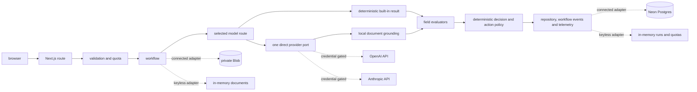

# Architecture

## Request flow

The browser sends non-sensitive source and execution-mode admission headers with the multipart request. The route applies a minute-window submission limit before multipart parsing and rejects impossible custom modes without reading the body. Multipart values remain authoritative and must exactly match the admission headers. After complete server-side file validation the route applies daily quotas and one idempotency claim. A cancellation signal travels from the response stream through the workflow to the selected provider.

The Workbench derives one route from the selected model and the matching provider-availability boolean. A built-in sample uses the selected direct adapter when that provider is available. If it is unavailable the built-in sample uses the committed deterministic result and states `Sample results - no AI processing`. A custom upload has no deterministic fallback. Its `Process document` control is disabled and states `Processing unavailable for this model` when the selected provider is unavailable.

`GET /api/models` returns the server-owned catalogue, provider defaults and one boolean for each provider's availability. It returns no credential material. OpenAI and Anthropic keys stay inside the server container. Configuration does not establish acceptance and each of the four built-in or custom provider routes remains pending until its own connected production smoke test passes.

Deterministic synthetic fixtures are trusted application data and retain their fixed outcomes. The checked-in PDFs keep typed business fields as native PDF text while handwritten reviewer and receiver comments are raster images. Every provider-routed run crosses a server-owned grounding boundary before field evaluation. Text-native PDF pages are extracted with `unpdf`. PNG, JPEG and PDF pages without usable text are processed locally with Tesseract.js, bundled English language data and a server-side canvas renderer. Page count, decoded image allocation, page text, OCR time and overall grounding time are bounded. Grounded page text remains in process memory and is never persisted or returned.

Each provider-routed field can pass only when the claimed page exists, its evidence maps to a contiguous page span after bounded Unicode, whitespace and punctuation normalization and its server-normalized value is supported by that grounded evidence. Provider instructions require unclear critical handwriting to return null instead of a guessed or reconstructed value. A parser, renderer, OCR or grounding failure produces a safe failed run instead of Clear or Evidence-consistent. The provider cannot directly choose the assurance outcome.

## Persistence modes

Local keyless mode uses process-memory run, quota and document adapters. It is ephemeral and intended for review.

Connected mode uses Neon for runs, traces, workflow events, quota reservations, idempotency claims and cleanup jobs. Private Vercel Blob stores document bytes. Database and Blob configuration must be present together. Connected production also requires a strong purge-route secret before request handling starts. Production live mode requires Neon even when the controlled in-memory override is set.

The connected HTTP container also uses an atomic Neon minute-window limiter for submissions, active-document reads, metrics, public run lists and active run details. Every resource has a per-bucket limit and a deployment-wide global limit. The global row is locked before the caller bucket so rotated cookies and parallel serverless instances share one ceiling. Metrics reuse one 15-second in-process snapshot and coalesce concurrent aggregation while the Neon gate bounds total cross-instance work.

## Operations metrics and population boundaries

`GET /api/metrics` fills one allow-listed response from six sources. Concurrent fills are coalesced into the same 15-second cache snapshot.

| Source                                         | Scope                                                                         | Public dashboard use                                                        |
| ---------------------------------------------- | ----------------------------------------------------------------------------- | --------------------------------------------------------------------------- |
| Repository-wide anonymous run aggregate        | All retained anonymous summaries including tombstoned detail                  | Total, completion, review and failure counts                                |
| Repository-wide confirmed model-cost aggregate | `providerDispatched=true` completed runs with trustworthy nonzero token usage | Completed-run costs, confirmed tokens and provider, model and family splits |
| Quota snapshot                                 | Settled spend for today and month to date plus active reservations            | Settled API spend and daily budget position                                 |
| Newest 100 public run summaries                | At most 100 current summaries with active detail where available              | Workflow status, workflow activity, performance and explorer rows           |
| Repository-wide active-detail lifecycle        | Every unexpired detail record                                                 | Active documents, public uploads and expiry buckets                         |
| Repository-wide cleanup backlog                | Expired detailed runs awaiting tombstoning plus pending physical cleanup jobs | Cleanup backlog                                                             |

The newest-100 workflow population includes completed and failed terminal active runs. Its latest activity is the newest event by creation time then stable identifier. Each latest workflow projection includes the action, status and timestamp. It does not expose an event ID or recipient role. The parent public summary does include its run ID while workflow-status and workflow-activity aggregate projections contain counts only.

Cost populations never use selected configuration as execution attribution. Completed model-cost estimates require a confirmed dispatched completed run with valid usage. A failed dispatched request may add conservative settled spend to the quota ledger but it cannot enter the completed estimate, average or confirmed-usage split. Settled spend and active reservations are separate values. Remaining budget is the configured daily budget minus both values clamped at zero.

The Reference quality suite is computed independently from exactly 10 provider-neutral fixture observations. It does not enter provider usage. The resource calculator uses the confirmed average model cost only then applies an explicitly illustrative US$1 to S$1.35 conversion. Its savings output is not a measured operational result.

## Model catalogue and deterministic boundary

The server-owned catalogue contains GPT-5.6 Luna and GPT-5.6 Terra for OpenAI plus Claude Haiku 4.5 and Claude Sonnet 5 for Anthropic. Each entry fixes the provider, context window and pricing date. Unknown models and provider-model mismatches fail closed. An enabled built-in run uses the selected model route. An unavailable built-in run uses only its deterministic result and carries no actual provider attribution.

The Reference quality suite contains 10 provider-neutral fixture observations: 5 supplier invoices and 5 warehouse goods receipts. The suite has 2 Correct, 4 Needs attention and 4 Incorrect references with 2 Clear, 6 Needs review and 2 Incomplete expected outcomes. It detects 2 of 2 unreadable critical fixtures through missing evidence and the suite has zero false clears.

A separate 10 by 2 recorded-adapter matrix supplies 20 schema and configuration cases. It checks every fixture under both provider configurations without making a provider request. These cases are not provider observations and cannot support a model-accuracy claim.

The persisted `provider_dispatched` field is the only proof used for provider-call attribution. Public serializers expose actual provider and model values only when that field is true. Selected configuration remains separate and never upgrades fallback output into provider evidence.

## Processing admission and budget boundary

Only `POST /api/runs`, initiated by `Process document`, can reserve model budget. The server validates run admission, multipart agreement, idempotency and the selected model before quota reservation. Recorded built-in results reserve zero model cost. Browsing, previewing, comparison, metrics reads and simulated workflow actions cannot create a model-budget reservation.

## Simulated workflow boundary

Provider output may propose an action but deterministic server policy owns its final ready, needs-review or blocked status. `POST /api/runs/:id/workflow-actions` applies the public-read rate limit then verifies the browser-held run capability before parsing the strict action request. A server-owned allowlist maps run status and outcome to permitted actions. Actions that require a recipient accept one synthetic business-role label from the document-family catalogue and never an address.

The repository persists one idempotent event for each run, action and optional role identity. Events record user intent and preparation only. Failed runs allow only retry preparation or a diagnostic summary. Expired and deleted runs allow no workflow mutation. `POST /api/runs/:id/stage-action` remains a compatibility mapping to the same `approve_and_stage` event rather than a separate side effect.

`Prepare email copy` generates a bounded subject and body on demand then returns them only in the no-store response. Email copy is not written to Neon, run results or trace steps. Persisted event metadata is limited to event and run identifiers, action type, optional synthetic role, status and timestamp. Active public run detail exposes the event timeline until expiry or Delete now removes the detailed record.

No workflow path has model tools or an external connector. The application cannot send email or contact an ERP, ticketing, payment, inventory or access-control system. The browser capability authorizes only this simulated run state. It is not user authentication or tenant isolation.

Schema changes run through versioned migration files. Routine request handling issues data queries only.

## Provider dispatch lifecycle

Direct adapters accept only models from the server-owned four-model catalogue so displayed costs use the dated model-specific rate table. Each SDK call disables built-in retries, caps structured output at 2,000 tokens and composes the browser cancellation signal with a 45-second server deadline. The workflow owns the single permitted retry.

Before dispatch Neon atomically reserves the higher worst-case cost across the supported model context windows for two provider attempts. The live adapter persists a dispatch marker after SDK loading and client construction then immediately before generation. If cancellation wins while that marker is being stored then the workflow clears it before release. One successful dispatched attempt with safe nonnegative integer usage inside the model context and output cap settles its exact estimated response cost. A retry, unknown usage, timeout or terminal provider error settles the repository-stored reservation conservatively. An oversized reported settlement is capped at the stored reservation. If settlement cannot be confirmed then the reservation remains pending. Expired dispatched leases are reconciled into daily spend while expired never-dispatched leases are released. Early validation, storage, initialization and already-aborted paths settle at zero because no provider request was dispatched.

## Trust boundaries

- Uploaded bytes and labels are untrusted input.
- Provider output is untrusted until schema validation and deterministic evaluation finish.
- Typed fixture values are native PDF text. Handwritten comments are raster images and are not available as selectable comment text.
- Extracted document text and local OCR output are transient grounding material. Neither is stored in Neon, Blob metadata or public traces.
- Raw deletion tokens are browser-held capabilities. Only hashes are persisted.
- The same browser-held capability gates every simulated workflow mutation. It does not authorize an external business action.
- Recipient roles are server-owned synthetic labels. No workflow request accepts a recipient address.
- Document locators, deletion hashes, full prompts and provider error bodies stay server-side.
- Public responses contain bounded safe fields and no-store headers where document bytes are involved.
- The public-surface verifier scans pages, `/api/models`, run-list JSON, metrics JSON and at most eight active trace responses. It never fetches raw document URLs as text.

## Retention sequence

At expiry or Delete now the repository first marks details deleted, removes workflow events and denies public detail access. It then records a cleanup job before requesting Blob deletion. A failed Blob delete leaves the logical tombstone in place. Late workflow writes are conditioned on the active tombstone row so they cannot restore deleted detail. The document route rechecks current state and expiry after Blob retrieval before it returns bytes. The hourly purge retries durable cleanup jobs.
