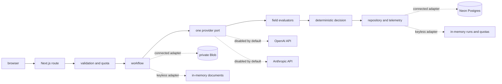

# Architecture

## Request flow

The browser submits a document choice and requested fields. The route validates the request before document parsing then applies submission limits, quota limits and one idempotency claim. A cancellation signal travels from the response stream through the workflow to the selected provider.

Exactly one provider port is selected for a run. Recorded mode returns deterministic fixture output without a network model call. Live mode calls the selected direct provider adapter only when the global switch and its server-side credential are present.

Field evaluators normalize values then check evidence and compare optional reference data. The provider cannot directly choose the assurance outcome. The deterministic decision maps the complete field set to Clear, Needs review or Incomplete.

## Persistence modes

Local keyless mode uses process-memory run, quota and document adapters. It is ephemeral and intended for review.

Connected mode uses Neon for runs, traces, quota reservations, idempotency claims and cleanup jobs. Private Vercel Blob stores document bytes. Database and Blob configuration must be present together. Production live mode requires Neon even when the controlled in-memory override is set.

Schema changes run through versioned migration files. Routine request handling issues data queries only.

## Trust boundaries

- Uploaded bytes and labels are untrusted input.
- Provider output is untrusted until schema validation and deterministic evaluation finish.
- Raw deletion tokens are browser-held capabilities. Only hashes are persisted.
- Document locators, deletion hashes, full prompts and provider error bodies stay server-side.
- Public responses contain bounded safe fields and no-store headers where document bytes are involved.

## Retention sequence

At expiry or Delete now the repository first marks details deleted and removes public detail access. It then records a cleanup job before requesting Blob deletion. A failed Blob delete leaves the logical tombstone in place. The hourly purge retries durable cleanup jobs.
