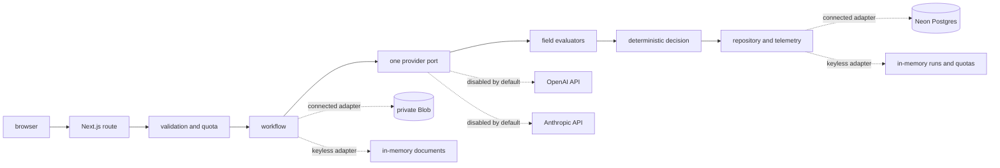

# Architecture

## Request flow

The browser sends non-sensitive source and execution-mode admission headers with the multipart request. The route applies a minute-window submission limit before multipart parsing and rejects impossible custom modes without reading the body. Multipart values remain authoritative and must exactly match the admission headers. After complete server-side file validation the route applies daily quotas and one idempotency claim. A cancellation signal travels from the response stream through the workflow to the selected provider.

Exactly one provider port is selected for a run. Recorded mode returns deterministic fixture output without a network model call. Live mode calls the selected direct provider adapter only when the global switch and its server-side credential are present.

Field evaluators normalize values then check evidence and compare optional reference data. The provider cannot directly choose the assurance outcome. The deterministic decision maps the complete field set to Clear, Needs review or Incomplete.

## Persistence modes

Local keyless mode uses process-memory run, quota and document adapters. It is ephemeral and intended for review.

Connected mode uses Neon for runs, traces, quota reservations, idempotency claims and cleanup jobs. Private Vercel Blob stores document bytes. Database and Blob configuration must be present together. Connected production also requires a strong purge-route secret before request handling starts. Production live mode requires Neon even when the controlled in-memory override is set.

The connected HTTP container also uses an atomic Neon minute-window limiter for submissions, active-document reads, metrics, public run lists and active run details. Every resource has a per-bucket limit and a deployment-wide global limit. The global row is locked before the caller bucket so rotated cookies and parallel serverless instances share one ceiling. Metrics reuse one 15-second in-process snapshot and coalesce concurrent aggregation while the Neon gate bounds total cross-instance work.

Schema changes run through versioned migration files. Routine request handling issues data queries only.

## Live provider lifecycle

Live adapters accept only `gpt-5-mini` for OpenAI and `claude-haiku-4-5` for Anthropic so displayed costs always use the dated model-specific rate table. Each SDK call disables built-in retries, caps structured output at 2,000 tokens and composes the browser cancellation signal with a 45-second server deadline. The workflow owns the single permitted retry.

Before dispatch Neon atomically reserves the higher worst-case cost across the supported model context windows for two provider attempts. A dispatch that may have reached a provider keeps its reservation instead of declaring the attempt free. Pending reservations use a 15-minute lease and a later atomic quota request reclaims stale leases. Early validation, storage and client-abort paths release their reservation because no provider dispatch occurred.

## Trust boundaries

- Uploaded bytes and labels are untrusted input.
- Provider output is untrusted until schema validation and deterministic evaluation finish.
- Raw deletion tokens are browser-held capabilities. Only hashes are persisted.
- Document locators, deletion hashes, full prompts and provider error bodies stay server-side.
- Public responses contain bounded safe fields and no-store headers where document bytes are involved.
- The public-surface verifier scans pages, run-list JSON, metrics JSON and at most eight active trace responses. It never fetches raw document URLs as text.

## Retention sequence

At expiry or Delete now the repository first marks details deleted and removes public detail access. It then records a cleanup job before requesting Blob deletion. A failed Blob delete leaves the logical tombstone in place. Late workflow writes are conditioned on the active tombstone row so they cannot restore deleted detail. The document route rechecks current state and expiry after Blob retrieval before it returns bytes. The hourly purge retries durable cleanup jobs.
